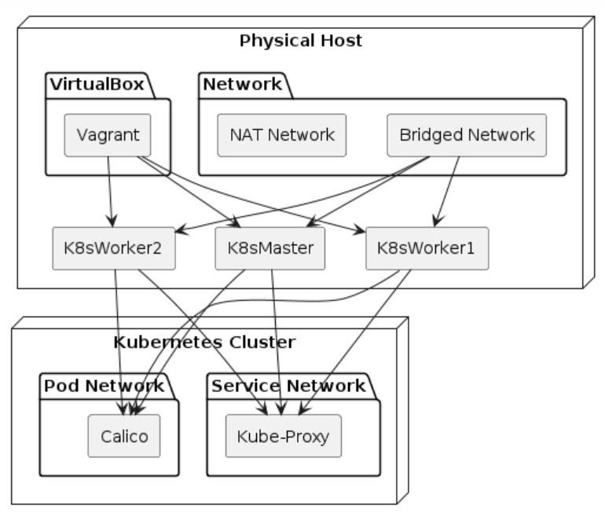

# Prepare Physical Host for Kubernetes 1.30 Vagrant Deployment with Calico

## Introduction

Setting up the physical host for deploying a virtual Kubernetes 1.30 cluster is a crucial step in building a robust and supported environment. By following these steps, you'll ensure that your server is properly configured to support and deploy the required virtual servers and networks.



## Installation

1. **Install Ubuntu 22.04 on your server:**
    - Download the Ubuntu 22.04 server ISO from the official Ubuntu website.
    - Burn the ISO to a bootable media (USB or DVD).
    - Insert the bootable media into your server and boot from it.
    - Follow the on-screen instructions to install Ubuntu 22.04.

2. **Update your system:**

    ```bash
    sudo apt update
    sudo apt upgrade
    ```

3. **Install libvirt and virtualbox:**

    ```bash
    sudo apt install qemu-kvm libvirt-daemon-system libvirt-clients bridge-utils virtualbox vagrant
    ```

4. **Add your user to the libvirt group:**

    ```bash
    sudo adduser `id -un` libvirt
    ```

5. **Validate Installs**

    ```bash
    virsh list --all
    vagrant --version
    ```

6. **Create a new bridge:**
    - Get the name, ip, subnet and default route of your network interface using `ip route`.  Common response will be something like `enp4s0` or `wlp3s0`:

    ```bash
    ip route # here you will need to figure out which interface is the one you want to bridge

    bridge_interface="enp4s0"
    cidr=$(ip -4 address show $bridge_interface | awk '/inet / {split($2, parts, "/"); print parts[1], parts[2]}')
    ip=$(echo $cidr | awk '{print $1}')
    prf=$(echo $cidr | awk '{print $2}')
    default_route=$(ip route show dev $bridge_interface default | awk '{print $3}')

sudo tee /tmp/net_conf.yaml <<EOF
network:
    version: 2
    renderer: networkd
    ethernets:
        enp4s0:
            dhcp4: no
            addresses:
                - $ip/$prf
            gateway4: $default_route
    bridges:
        br0:
            interfaces: [$bridge_interface]
            dhcp4: yes
EOF

# TODO: File needs to be moved here, but i need to add additional protect and verification steps.
cp ~/net_conf.yaml /etc/netplan/01-netcfg.yaml
    ```

    - Open the `/etc/netplan/01-netcfg.yaml` file in a text editor:

    ```bash
    sudo vi /etc/netplan/01-netcfg.yaml
    ```

    - Add the following configuration, replacing `eth0` with your network interface name:

    I am still working on the bridging section.  The following is a placeholder.  Risk of loosing access to the server here.

    ```yaml
    network:
    version: 2
    renderer: networkd
    ethernets:
        enp4s0:
        dhcp4: no
        addresses:
            - 192.168.1.219/24
        gateway4: 192.168.1.254
    bridges:
        br0:
            interfaces: [enp4s0]
            dhcp4: yes
    ```

    - Save and close the file.

7. **Apply the configuration:**

    ```bash
    sudo netplan apply
    ```

8. **Verify the bridge:**

    ```bash
    ip addr show br0
    ```

9. **Configure Vagrant to use the bridge:**
    - In your `Vagrantfile`, configure the network as follows:

    ```ruby
    config.vm.network "public_network", bridge: "br0"
    ```
